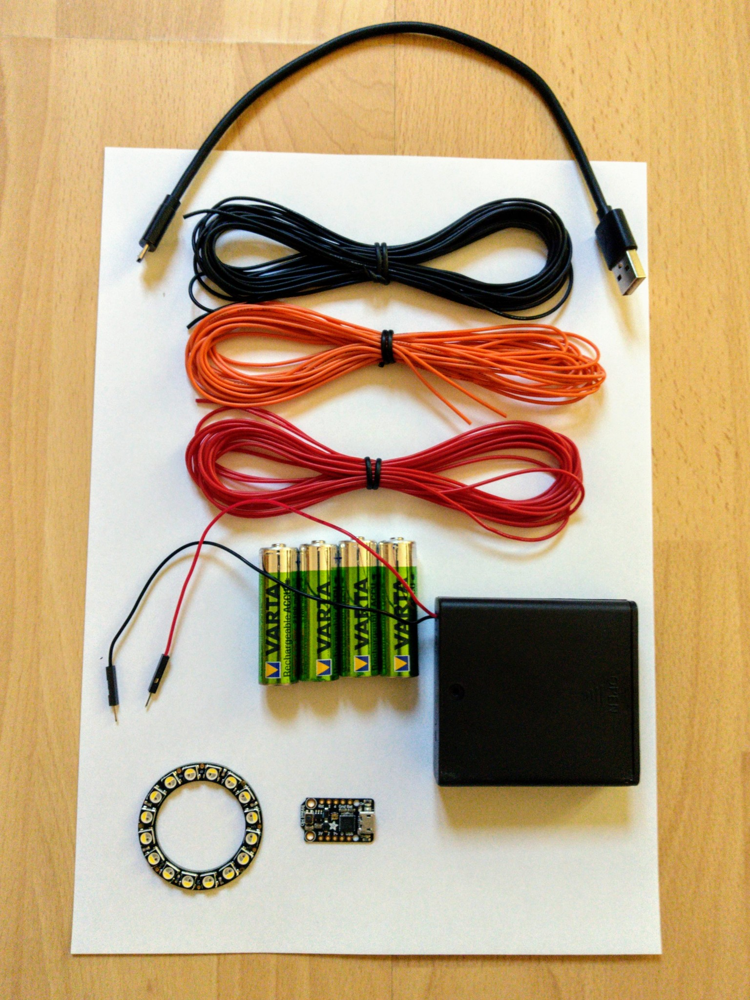
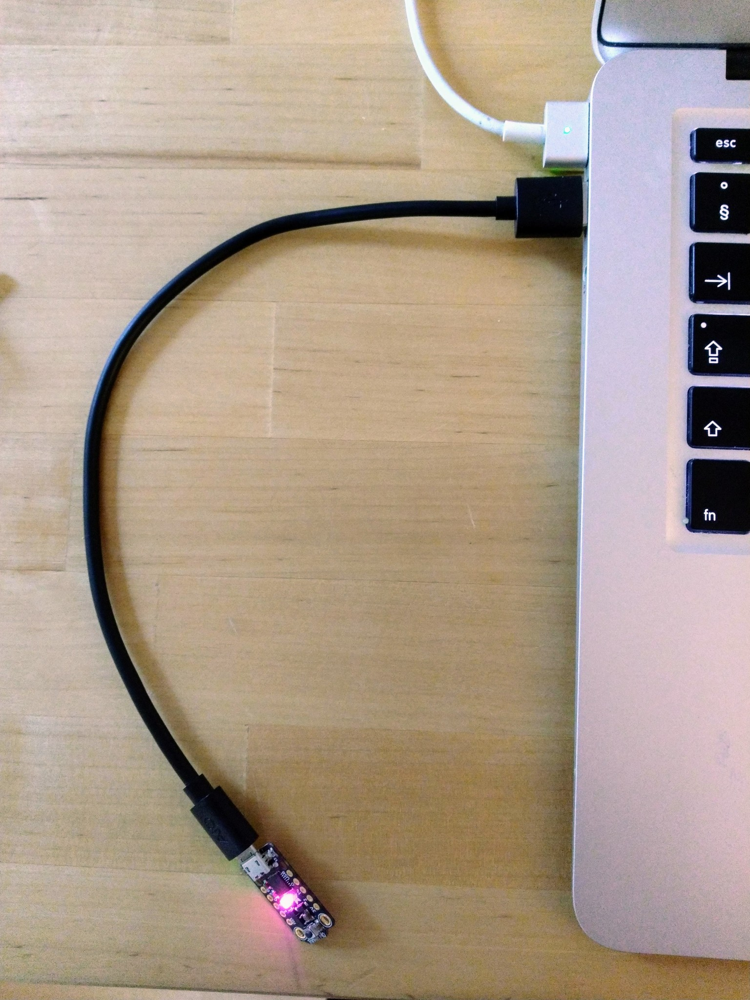
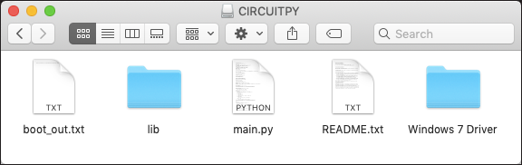
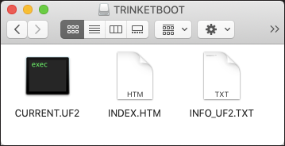
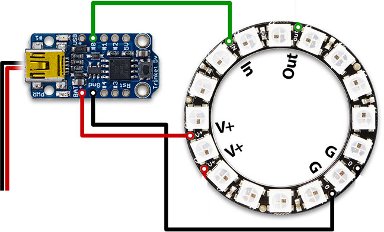
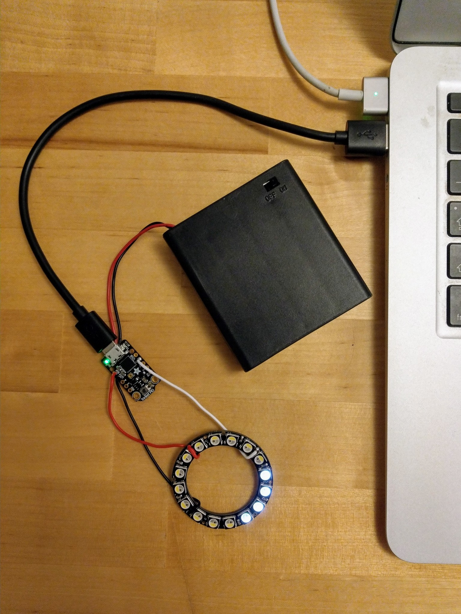

Lighthouse light
================

Parts
-----

* [Trinket M0](https://www.adafruit.com/product/3500)
* [NeoPixel ring - 16 x 5050 RGBW LEDs with integrated drivers - cool white - ~6000K](https://www.adafruit.com/product/2856)
* [4 x AA battery holder with on/off Switch](https://www.adafruit.com/product/830)

Initially I intended to use silicone coated stranded wire [like this](https://hobbyking.com/en_us/turnigy-22awg-siliconewire-red-2m.html) as it's far more flexible. But threading stranded wire through the deep holes of the NeoPixel ring doesn't work well. In the end, I used normal solid core wire [like this](https://www.adafruit.com/product/1311) instead.

Depending on whether you're computer has old style USB A ports or newer USB C ports, you'll need a USB mirco to USB A cable [like this](https://www.digitec.ch/en/s1/product/value-usb-20-kabel-a-micro-015m-20-usb-cables-2750900) or a USB micro to USB C cable [like this](https://www.digitec.ch/en/s1/product/value-usb-c-micro-b-c-micro-1m-20-usb-cables-11694379?tagIds=77-532).



### Alternatives:

* [ItsyBitsy M0 Express](https://www.adafruit.com/product/3727)
* [DotStar LED Strip - Addressable Cool White - 60 LED/m - ~6000K](https://www.adafruit.com/product/2433?length=1)

The ItsyBitsy M0 Express has considerably more flash RAM which makes a diffence when programming in Python (it has 256MB of on-chip flash RAM, like the Trinket M0, but also has an additional 2MB flash RAM chip).

DotStars are the successors to NeoPixels (they're smaller and have a higher PWM rate) and this particular strip is pure white (with no RGB LEDs). However it's only available in lengths of 1m or more (though you can cut strips down to any size).

If using a strip you probably also want a Blinkinlabs soldering kit (which they oddly call a repair kit) for making it easier to solder onto the end of a strip - they have a [DotStar kit](https://shop.blinkinlabs.com/products/led-strip-repair-kit-for-apn102-dotstar-strips-10-pieces) and a [NeoPixel kit](https://shop.blinkinlabs.com/products/digital-led-strip-repair-renforcement-kit). These kits are also available from [Digitec](https://www.digitec.ch/en/brand/blinkinlabs-17841).

### Batteries

[4 x NiMH rechargeable batteries](https://www.digitec.ch/en/s1/product/varta-recharge-accu-power-battery-4pcs-aa-battery-2100mah-rechargeable-batteries-chargers-220503) (or the same [batteries with a charger](https://www.digitec.ch/en/s1/product/varta-lcd-plug-charger-battery-charger-4pcs-aa-battery-2100mah-rechargeable-batteries-chargers-583770)).

**Important:** you can only use *NiMH* batteries with this setup. Normal alkaline batteries have a slightly higer voltage than rechargeable batteries and this difference is enough to destroy the NeoPixels. Alternatively one could use a [3 cell battery holder](https://www.pololu.com/product/1152) with alkaline batteries. Or one could introduce a [voltage regulator with a 5V output](https://www.pololu.com/product/2850).

Setup
-----

Adafruit has [comprehensive documentation](https://learn.adafruit.com/adafruit-trinket-m0-circuitpython-arduino?view=all) for the Trinket M0.





First plug it in. Your computer should recognise it as both:

* A USB drive called CIRCUITPY.
* A [serial device](https://en.wikipedia.org/wiki/Serial_port).

It may also mistakenly be detected as an unknown keyboard type (this isn't really a mistake as the Trinket can emulate USB devices like a keyboard).

In the middle of the Trinket M0 board is a single DotStar which should start cycling through various colors - this is being done by the pre-installed Python example. Take a look at the files on the drive - before we destroy them!

### Update the bootloader

It's always good to have the most up-to-date bootloader, especially as older versions have issues with the latest version of macOS.

First [enter the bootloader mode](https://learn.adafruit.com/adafruit-trinket-m0-circuitpython-arduino?view=all#entering-bootloader-mode-46-6) by double taping the reset button on the board so that the red LED starts to pulse.

Note: every time you press the reset button your computer will complain that the disk corresponding to the Trinket M0 wasn't properly ejected - don't worry about this.



Now the Trinket should show up as a different USB drive called TRINKETBOOT. Take a look at the contents of `INFO_UF2.TXT` there:

```
$ cat /Volumes/TRINKETBOOT/INFO_UF2.TXT
UF2 Bootloader v2.0.0-adafruit.7 SFHWRO
Model: Trinket M0
Board-ID: SAMD21E18A-Trinket-v0
```

Find the most recent bootloader for the Trinket M0 on the Adafruit GitHub [UF2 releases page](https://github.com/adafruit/uf2-samdx1/releases/) - search for the latest `.uf2` file called `update-bootloader-trinket_m0` (as the time of writing this was `update-bootloader-trinket_m0-v3.7.0.uf2`), download it and copy it to the TRINKETBOOT boot drive.

This causes the Trinket M0 to automatically update its bootloader - once the drive is available again check that the bootloader version has been updated:

```
$ cat /Volumes/TRINKETBOOT/INFO_UF2.TXT
UF2 Bootloader v3.7.0 SFHWRO
Model: Trinket M0
Board-ID: SAMD21E18A-Trinket-v0
```

Note: the Adafruit documentation doesn't seem to keep up-to-date with bootloader releases so it's best to go direct to GitHub.

Updating the bootloader erases the drive and removes the ability to return to the CIRCUITPY drive. We'll resolve that now...

### Update CircuitPython

Download the latest stable version of CircuitPython for the Trinket M0 from [here](https://circuitpython.org/board/trinket_m0/) (4.1.0 at the time of writing).

This is just another `.uf2` file - simply drag it onto the TRINKETBOOT drive as before. When the update process finishes the drive will show up again as CIRCUITPY.

We can check the CircuitPython version like so:

```
$ cat /Volumes/CIRCUITPY/boot_out.txt
Adafruit CircuitPython 4.1.0 on 2019-08-02; Adafruit Trinket M0 with samd21e18
```

Note that the drive also includes a `.fseventsd/no_log` and a `.metadata_never_index` file along with a `.Trashes` directory. These all tell macOS not to waste space on the drive with the various hidden files it usually generates.

If you want to reinstall the example that came pre-installed you can find it [here](https://learn.adafruit.com/adafruit-trinket-m0-circuitpython-arduino/downloads) - just click the "Default CircuitPython files included with v2" button. You just need the `main.py` file along with the contesnts of the `lib` folder (and the `README.md` is informative).

Connecting to the REPL
----------------------

As mentioned above, the Trinket M0 also appears as a serial device (as well as a USB drive). If you connect to this you can access the CircuitPython REPL (full details on how to connect can be found [here](https://docs.micropython.org/en/latest/pyboard/tutorial/repl.html)). On macOS you simply do:

```
$ screen /dev/tty.usbmodem*

Auto-reload is on. Simply save files over USB to run them or enter REPL to disable.
Press any key to enter the REPL. Use CTRL-D to reload.
^D
Adafruit CircuitPython 4.1.0 on 2019-08-02; Adafruit Trinket M0 with samd21e18
>>> help()
Welcome to Adafruit CircuitPython 4.1.0!
Please visit learn.adafruit.com/category/circuitpython for project guides.
To list built-in modules please do `help("modules")`.
>>> help("modules")
__main__          digitalio         pulseio           sys
...
Plus any modules on the filesystem
>>> import board
>>> dir(board)
['A0', 'A1', 'A2', 'A3', 'A4', 'APA102_MOSI', 'APA102_SCK', 'D0', 'D1', ...]
>>> ^D
soft reboot
Auto-reload is on. Simply save files over USB to run them or enter REPL to disable.
Press any key to enter the REPL. Use CTRL-D to reload.
```

Press `ctrl-A` `ctrl-\` to quit `screen` and `ctrl-A` `?` to get terse help.

For more on the REPL see the [REPL section](https://learn.adafruit.com/adafruit-trinket-m0-circuitpython-arduino?view=all#the-repl) of the documentation.

As you can see above the standard Python built-in function [`dir`](https://realpython.com/python-modules-packages/#the-dir-function) is the easiest way to inspect any module (or any other Python structure).

For more details on `board`, `analogio` and the other core modules, see the [API documentation](https://circuitpython.readthedocs.io/en/4.x/shared-bindings/index.html).

**Important:** copying programs to the Trinket M0 drive is very convenient but it's only via the serial interface that you'll see errors from CircuitPython, e.g. due to syntax errors in your program or exceptions that occur while running. Unlike C on a traditional MCU, CircuitPython reports informative stack-traces when errors occur.

Intalling libraries
-------------------

You can download the latest libraries bundle [here](https://circuitpython.org/libraries) or directly from GitHub [here](https://github.com/adafruit/Adafruit_CircuitPython_Bundle/releases/). Choose the version suitable for your CircuitPython version (`adafruit-circuitpython-bundle-4.x-mpy-20191211.zip` at the time of writing - there's also a 5.x version, but this is for 5.x version of CircuitPython that's currently still in beta).

You can find the library documentation [here](https://circuitpython.readthedocs.io/projects/bundle/en/latest/#table-of-contents).

Let's use the `adafruit_dotstar` library to turn off the DotStar on the Trinket M0:

```
$ unzip ~/Downloads/adafruit-circuitpython-bundle-4.x-mpy-20191211.zip
$ cd adafruit-circuitpython-bundle-4.x-mpy-20191211
$ cp lib/adafruit_dotstar.mpy /Volumes/CIRCUITPY/lib
$ cat > main.py << EOF
import board
import adafruit_dotstar
dot = adafruit_dotstar.DotStar(board.APA102_SCK, board.APA102_MOSI, 1)
dot[0] = (0, 0, 0)
EOF
$ mv main.py /Volumes/CIRCUITPY
```

When `main.py` is moved to the CIRCUITPY drive the Trinket M0 will restart (and once our program runs, the DotStar will be turned off).

Wiring
------

The wiring is essentially identical to that in the Adafruit ["Kaleidoscope Eyes" tutorial](https://learn.adafruit.com/kaleidoscope-eyes-neopixel-led-goggles-trinket-gemma?view=all) except they use two rings there, rather than just one. Here's a modified version of the wiring diagram found there with the second ring removed:



Note: the pin names are printed on the both the front and back of the ring - but much easier to read on the back.

See [`soldering.md`](soldering.md) for photos of each step in the soldering process.

As suggested, in the Adafruit tutorial, I inserted the wires from the front, then soldered on the back of the ring - this seems the wrong way around but it's much easier than trying to apply solder between the pixels on the front of the ring.

**Important:** the Adafruit tutorial uses an RGB ring (with three LEDs per pixel) while we're using an RGBW ring with an additional white LED per pixel. This doesn't affect the wiring but it does mean the code examples in the tutorial won't work without modification.

USB power is enough to power the Trinket M0 put not enough to power the NeoPixels.  So if you want to see the NeoPixels lighting up while doing development, i.e. editing `main.py` and copying it to the Trinket M0 USB drive, you'll need to turn on the battery pack. It's safe to do this even while connected via USB to your computer (all the necessary diodes etc. are there on the Trinket M0 to prevent power flowing in the wrong direction).



Coding
------

Assuming you're still in the `lib` directory that we unpacked earler:

```
$ cp lib/neopixel.mpy /Volumes/CIRCUITPY/lib
```

Then create create a `main.py` containing the following and copy it to the CIRCUITPY disk:

```
import board
import neopixel

import time

numpix = 16
pixel = neopixel.NeoPixel(board.D0, numpix, bpp = 4, auto_write = False)

i = 0

while True:
    pixel[i] = (0, 0, 0, 0)
    pixel[(i + 1) % numpix] = (0, 0, 0, 0xff)
    pixel.show()

    i = (i + 1) % numpix

    time.sleep(0.05)
```

Note: you can quadruple the brightness by setting all LEDs to `0xff` rather than leaving the RGB LEDs off. Each LED draws a maximum of 20mA, so setting all four LEDs of a pixel to maximum brightness draws 80mA. If you light all 16 pixels of the ring like this, it will draw a bit more than an Amp - this is fine, but you should keep track of the current you're drawing if you start using strips or rings with more pixels.

Unlike the first trivial program, this one has an infinite loop here, i.e. the program does not run, exit and then return control to the REPL. To get to the REPL press ctrl-C and to later do a soft reboot (i.e. rerun the program) press ctrl-D.

Main program
------------

For a more advanced program with the ability to control the behavior of the pixels at runtime see [`main.py`](main.py).

If you look at the serial console, you'll see:

```
Commands by example:
* delay 50 - set the update delay to 50ms.
* color 0xff 0 0 0 - set color to red (by updating red, green, blue and white LEDs).
* width 4 - set the number of lit pixels to 4.
* reverse - reverse the direction of rotation.
>
```

If you connect to the serial console after the Trinket M0 has started up, just press ctrl-D to redisplay these instructions.

Try entering `reverse` for starters. Note that the pixels will stop moving once you start typing (as the `input()` function blocks until return is pressed).
