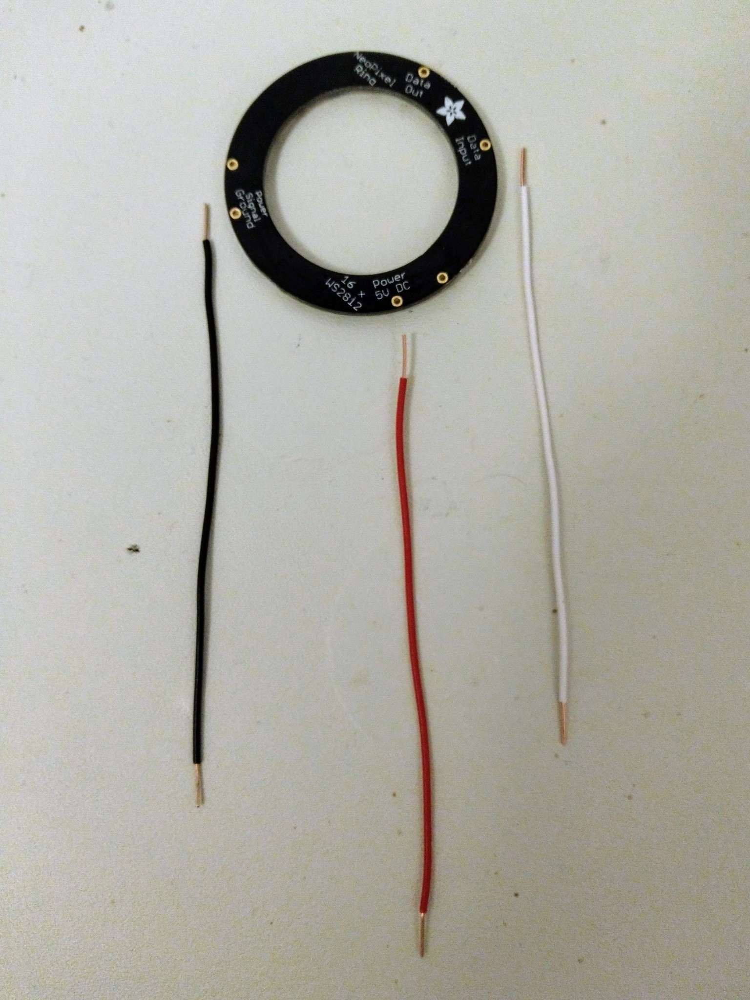
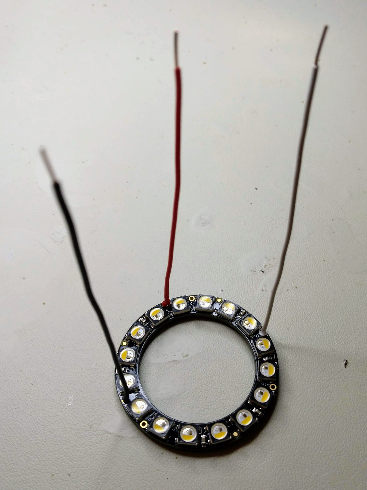
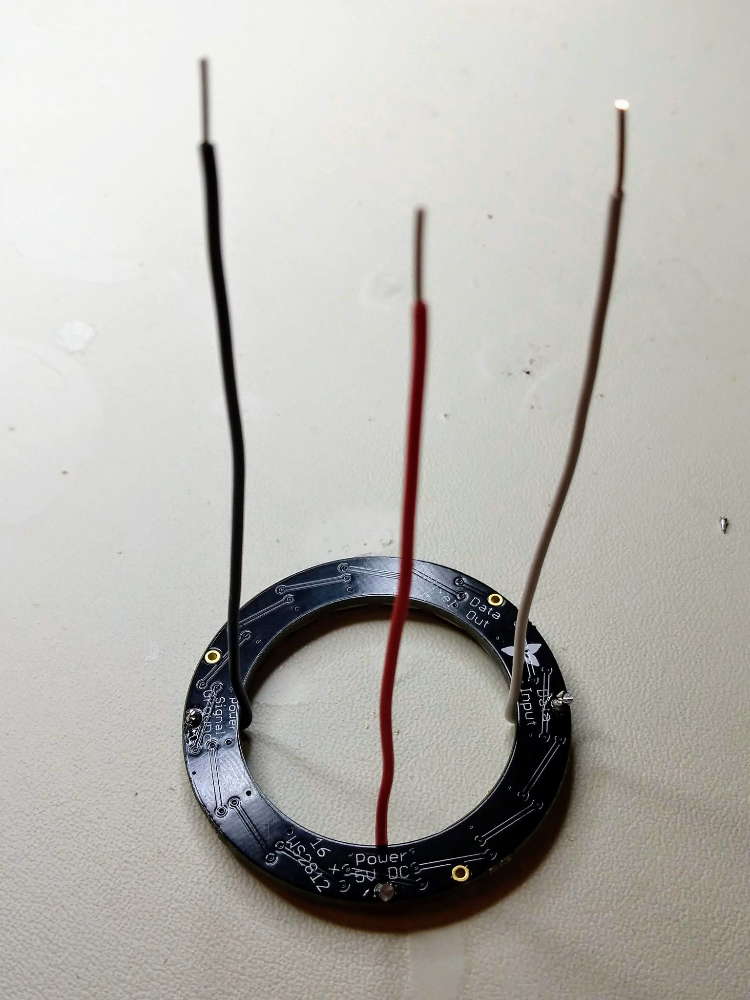
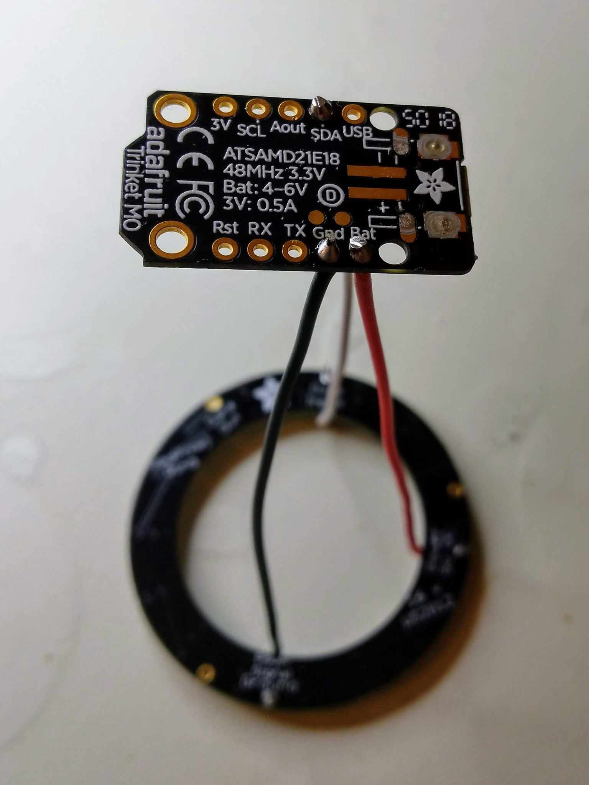
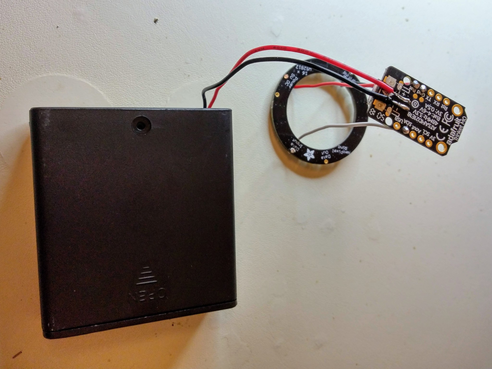
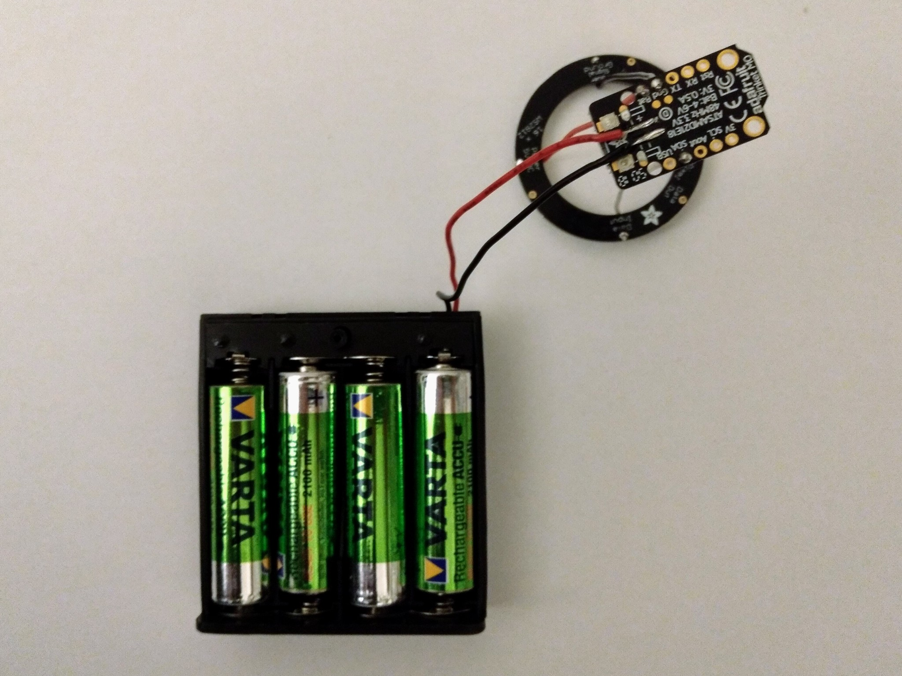
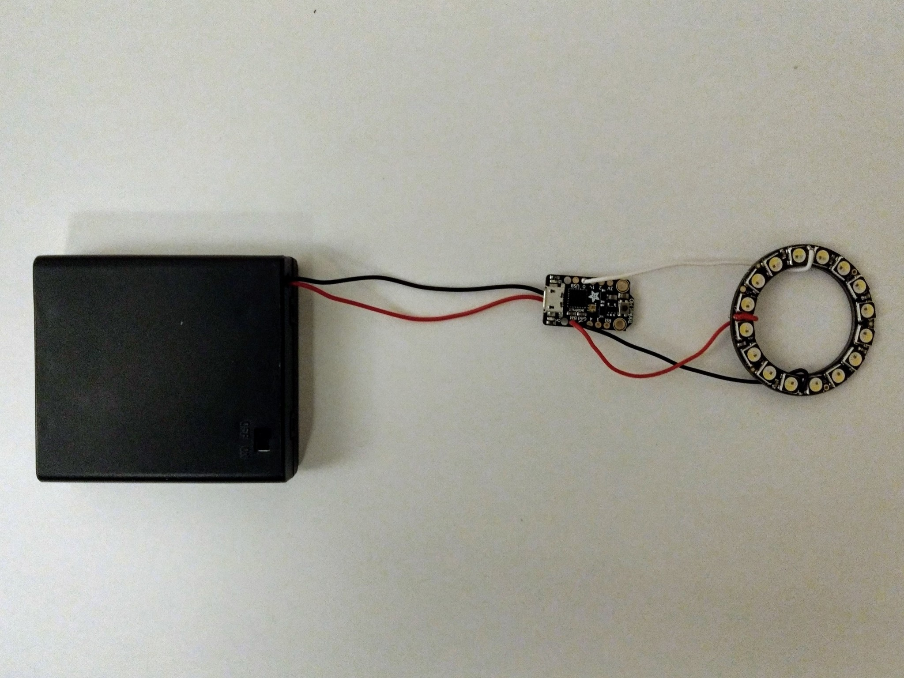

Soldering
=========

The following photos show:

* The soldering of wires to the NeoPixel ring.
* The soldering of those wires to the Trinket M0.
* The soldering of the battery holder to the Trinket M0.

_Power, ground and data wires._  

_Wires soldered onto the front of the ring._  

_Wires bent behind the ring._  

_Wires soldred to the Trinket M0._  

_Battery holder soldered to the Trinket M0._  

_Batteries inserted into holder._  

_Ready for use._  

